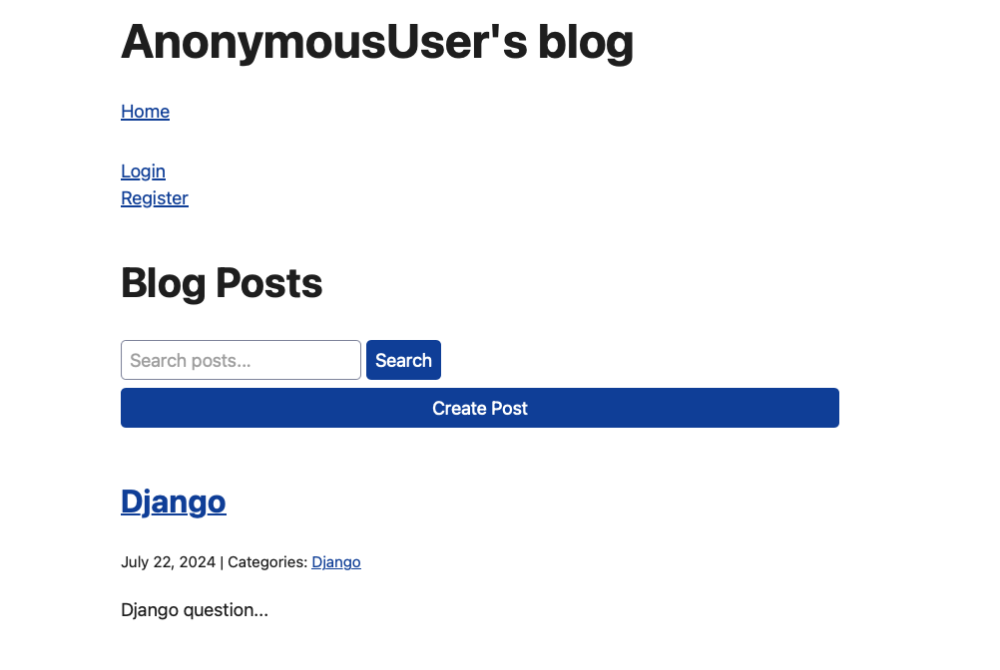

# Introduction
The Blog App is a web application that allows users to create, view, update, and delete blog posts. Users can also categorize posts, leave comments, and search for specific posts. The application is built using Django, a high-level Python web framework that encourages rapid development and clean, pragmatic design.

## Features
User Authentication: Secure login and registration for users. Users can not modify other people's post or comments.
Create and Manage Posts: Users can create new blog posts, edit their existing posts, and delete posts they no longer want.
Create and Manage Comments: Users can leave and manage their comments left on posts.
Search Functionality: Users can search for posts using keywords.
Categorization: Posts can be categorized, and users can filter posts by categories.

## Prerequisites
Python 3.x
Django 3.x or higher